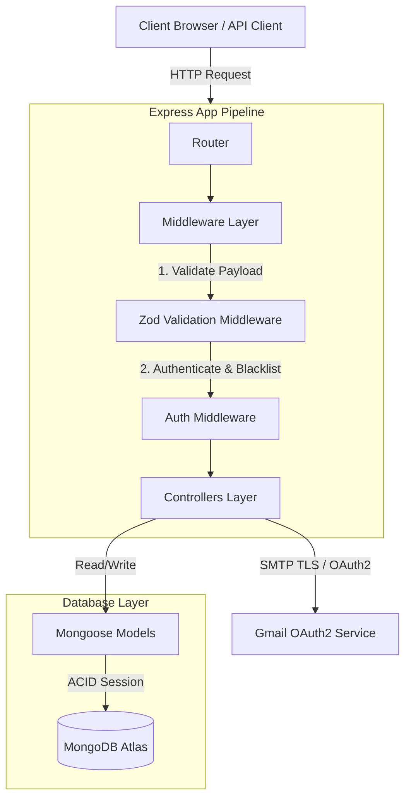
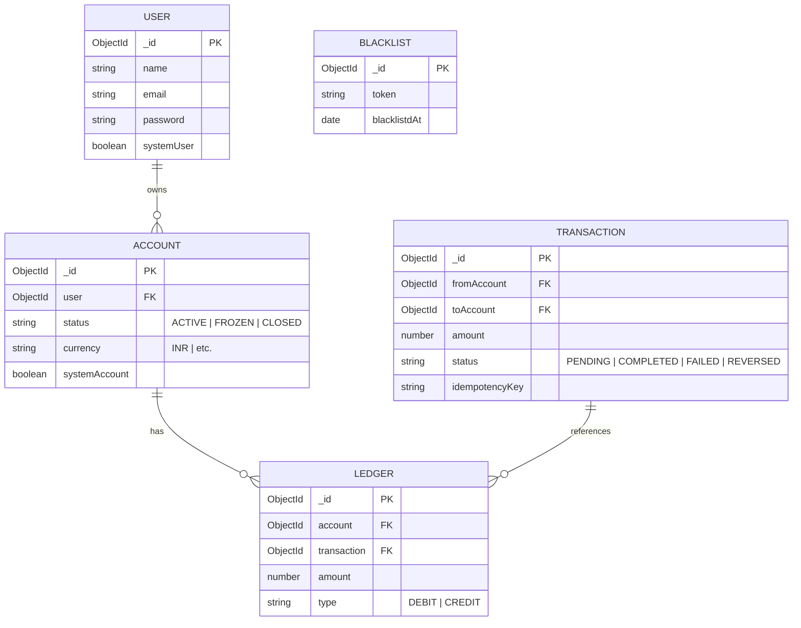
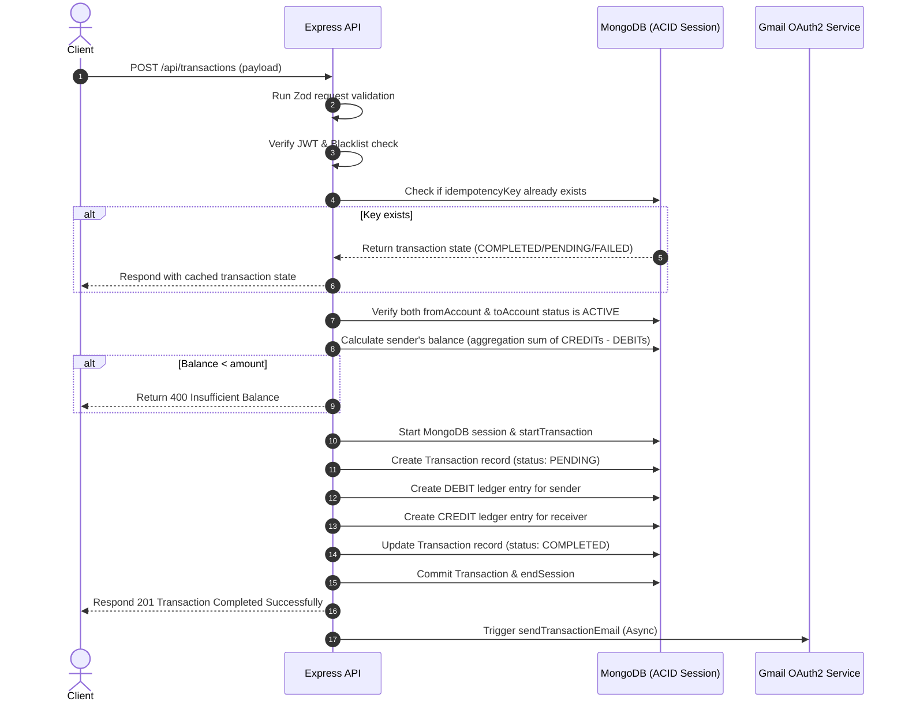

# 🏦 Banking Ledger - Backend API

[](https://nodejs.org/)
[](https://expressjs.com/)
[](https://www.mongodb.com/)
[](https://zod.dev/)
[](https://jwt.io/)
[](http://localhost:3000/api-docs)

A production-grade, highly secure **Banking Ledger System** API built with Node.js, Express, and MongoDB. This system implements **double-entry bookkeeping** principles where the immutable ledger serves as the single source of truth for all account balances.

---

## 🏗️ System Architecture & Dataflow

### 1. General System Architecture
The application follows a clean MVC/layered structure separating routes, request validation, authentication middlewares, business logic controllers, and database access schemas.



### 2. Database Entity Relationship Diagram (ERD)
All account balances are derived in real-time from matching debit/credit ledger records. **Balances are never stored as mutable numbers directly in accounts.**



### 3. The 10-Step Transaction Flow
This diagram illustrates the sequence of checks, transactions, and notification dispatches during a peer-to-peer money transfer.



---

## 💪 Core Strengths & Architectural Quality

* **Immutable Ledger Integrity**: Ledger records cannot be updated or deleted. Database-level `pre` hooks and field immutability constraints block all tampering attempts, ensuring a perfect audit trail.
* **Full ACID Safety**: Peer-to-peer transfers are wrapped in MongoDB database sessions. If any individual database insertion fails (e.g. database network drops), the entire operation rolls back.
* **Hardened Idempotency Guarantee**: Submitting the same transaction payload twice returns the cached result of the original transaction, eliminating double-spending risk.
* **JWT Session Blacklisting (Secure Logout)**: Blacklisted tokens are stored in a high-speed collection with a MongoDB TTL index (automatically expiring and cleaning up from the DB after 3 days).
* **Defensive Schema Parsing**: Powered by Zod, payload validation runs at the router level, automatically sanitizing inputs (trimming/lowercasing emails) and short-circuiting malformed requests before hitting controllers.

---

## 🗂️ Project Structure

```
Banking_System_Backend(Advanced)/
├── server.js                    # Entry point & connection boot
├── package.json                 # Core dependencies and runtime scripts
├── setup-system-user.js         # Privileged system user bootstrap script
└── src/
    ├── app.js                   # Express configuration, routing, and Swagger UI
    ├── config/
    │   ├── db.js                # MongoDB connection management
    │   └── swagger.js           # Swagger OpenAPI specification definitions
    ├── controllers/
    │   ├── auth.controller.js   # User auth handlers (Register, Login, Logout)
    │   ├── account.controller.js# Account management & dynamic ledger balance
    │   └── transaction.controller.js # Atomic transfer logic & funds seeding
    ├── middleware/
    │   ├── auth.middleware.js   # JWT authentication & session blacklist checks
    │   └── validate.middleware.js # Generic Zod validation handler
    ├── model/
    │   ├── user.model.js        # User document schema
    │   ├── account.model.js     # Account document schema
    │   ├── transaction.model.js # Transaction tracking schema
    │   ├── ledger.model.js      # Immutable double-entry ledger database schema
    │   └── blacklist.model.js   # Token blacklist document schema (TTL indexed)
    ├── routes/
    │   ├── auth.route.js        # Auth routing rules & Swagger specs
    │   ├── account.route.js     # Account routing rules & Swagger specs
    │   └── transaction.route.js # Transaction routing rules & Swagger specs
    ├── services/
    │   └── email.service.js     # Nodemailer and Gmail OAuth2 service
    └── validators/
        ├── auth.validator.js        # Schema constraints for register & login
        ├── account.validator.js     # Schema constraints for account creations
        └── transaction.validator.js # Schema constraints for transaction transfers
```

---

## 🚀 Getting Started

### Prerequisites
* **Node.js** (v18+)
* **MongoDB Atlas** (or a local MongoDB replica set for transaction sessions support)
* **Google Cloud Project Credentials** (for Gmail OAuth2 email dispatch)

### Installation
1. Clone the repository:
   ```bash
   git clone https://github.com/devbyhimans/Bank_ledger.git
   cd Bank_ledger/Banking_System_Backend(Advanced)
   ```
2. Install the required dependencies:
   ```bash
   npm install
   ```

### Environment Setup
Create a `.env` file in the root directory (`Banking_System_Backend(Advanced)/`):
```env
PORT=3000
MONGO_URI=mongodb+srv://<username>:<password>@cluster.mongodb.net/BankingLedger
JWT_SECRET=your_high_entropy_jwt_secret_key

# Gmail OAuth2
EMAIL_USER=your_gmail_address@gmail.com
CLIENT_ID=your_google_client_id
CLIENT_SECRET=your_google_client_secret
REFRESH_TOKEN=your_google_refresh_token
```

### Initial Bootstrap
Run the setup script to bootstrap the system user and a corresponding system account (needed to seed initial funds to new users):
```bash
node setup-system-user.js
```

### Running the Server
* **Development mode** (with hot-reload):
  ```bash
  npm run dev
  ```
* **Production mode**:
  ```bash
  npm start
  ```

---

## 📡 API Endpoints Reference

> 💡 Interactive swagger documentation is served at [`http://localhost:3000/api-docs`](http://localhost:3000/api-docs) once the server starts.

### 1. Authentication (`/api/auth/*`)
| Method | Path | Description | Authorization | Payload Validation |
| :--- | :--- | :--- | :--- | :--- |
| **POST** | `/register` | Sign up user & send welcome email | Public | Zod Schema |
| **POST** | `/login` | Authorize session and acquire JWT | Public | Zod Schema |
| **POST** | `/logout` | Invalidate token and clear cookies | JWT Protected | Session Token |

### 2. Accounts Management (`/api/accounts/*`)
| Method | Path | Description | Authorization | Payload Validation |
| :--- | :--- | :--- | :--- | :--- |
| **POST** | `/create` | Open a new bank account | JWT Protected | Zod Schema |
| **GET** | `/` | Retrieve list of owned accounts | JWT Protected | Session Token |
| **GET** | `/balance/:accountId` | Query balance (dynamic ledger aggregation) | JWT Protected | Path Param |

### 3. Transactions & Transfers (`/api/transactions/*`)
| Method | Path | Description | Authorization | Payload Validation |
| :--- | :--- | :--- | :--- | :--- |
| **POST** | `/` | Execute P2P transfer (ACID Compliant) | JWT Protected | Zod Schema |
| **POST** | `/system/intial-funds` | Seed funds into account | System User only | Zod Schema |

### 4. Interactive Docs
| Method | Path | Description |
| :--- | :--- | :--- |
| **GET** | `/api-docs` | Interactive Swagger UI (includes auth persisting) |

---

## 🔧 Technical Stack Details

* **Language/Platform**: Node.js & Javascript (CommonJS module system)
* **HTTP Router**: Express.js v5.0 (supporting modern middleware patterns)
* **DBMS & ODM**: MongoDB Atlas & Mongoose v9.x
* **Validation Engine**: Zod v4.x
* **Crypto & Signatures**: JWT (jsonwebtoken) & bcrypt
* **Documentation**: swagger-jsdoc & swagger-ui-express

---

## 📄 License
Licensed under the [ISC License](LICENSE).

---
Built with ❤️ by [devbyhimans](https://github.com/devbyhimans)
